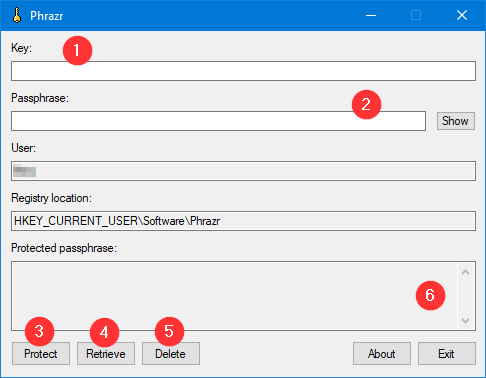

# Phrazr
Phrazr is a tool which uses Microsoft Data Protection API (DPAPI) to protect a passphrase and store it in the registry. The stored passphrase can later be retrieved to be used in other applications. This can only be done with the same user which was used to protect the passphrase.

## License

Copyright 2021 Nino Camdzic

Permission is hereby granted, free of charge, to any person obtaining a copy of this software and associated documentation files (the "Software"), to deal in the Software without restriction, including without limitation the rights to use, copy, modify, merge, publish, distribute, sublicense, and/or sell copies of the Software, and to permit persons to whom the Software is furnished to do so, subject to the following conditions:

The above copyright notice and this permission notice shall be included in all copies or substantial portions of the Software.

THE SOFTWARE IS PROVIDED "AS IS", WITHOUT WARRANTY OF ANY KIND, EXPRESS OR IMPLIED, INCLUDING BUT NOT LIMITED TO THE WARRANTIES OF MERCHANTABILITY, FITNESS FOR A PARTICULAR PURPOSE AND NONINFRINGEMENT. IN NO EVENT SHALL THE AUTHORS OR COPYRIGHT HOLDERS BE LIABLE FOR ANY CLAIM, DAMAGES OR OTHER LIABILITY, WHETHER IN AN ACTION OF CONTRACT, TORT OR OTHERWISE, ARISING FROM, OUT OF OR IN CONNECTION WITH THE SOFTWARE OR THE USE OR OTHER DEALINGS IN THE SOFTWARE.

## Overview
1. Determine the user which will be able to store and retrieve the password.
2. Run `Phrazr.exe` as the determined user and save a passphrase in the registry.
3. Configure your application to run as the determined user.
4. Use `Phrazrg.exe` to retrieve the passphrase (See *Retrieving Passphrase* for more details).

## Real world scenario
**Decrypting private keys on Apache HTTP webserver startup**: When using encrypted private keys, Apache HTTP needs some way to retrieve the passphrase to be able to decrypt the private key. The `mod_ssl` module provides the `SSLPassphraseDialog` directive which can be used to call an external process to retrieve the passphrase.

## Storing the passphrase


1. Enter the registry key name, which will be used to store the passphrase. Phrazr stores all keys under `HKEY_CURRENT_USER\SOFTWARE\Phrazr`.
2. Enter the passphrase you wish to protect.
3. Click the *Protect* button to store the passphrase.
4. If you already have a key stored, you can retrieve it to make changes. First enter the key name and then click on *Retrieve*. To store the key again, click on *Protect*. You will be asked to confirm.
5. Existing keys can be deleted. Enter the key name and then click on *Delete*. You will be asked to confirm.
6. The protected passphrase will be shown here as a Base64 string.

## Retrieving the passphrase
Keeping in mind the above real world scenario, you want to make sure that you call Phrazrg with a user which can actually retrieve the passphrase. This means that Apache HTTP webserver must run as the same user which stored the passphrase. When `SSLPassphraseDialog` runs Phrazrg, it will use the same user.
```
SSLPassPhraseDialog "c:/tools/phrazr/mypass.exe"
```
Suppose we have a passphrase stored in a key called `mypass`. To retrieve the passphrase we rename `Phrazrg.exe` to `mypass.exe`. Phrazrg now knows which key to retrieve. Do not use spaces in key names. See *Known Issues* for more details.

## Known Issues

For some reason `SSLPassphraseDialog` interprets the result retrieved by Phrazrg as having a line ending. This results in the retrieved passphrase being wrong. To fix this, we can create a separate batch file(call it mypass.bat), where we call Phrazrg like so:

```
@echo off
mypass.exe
```

Put the batch file in the same directory as Phrazrg and change your `SSLPassPhraseDialog` line to:

```
SSLPassPhraseDialog "c:/tools/phrazr/mypass.bat"
```

I haven't looked too far into the issue but `@echo off` seems to solve line ending issue.

## Compatibility

**Tested on**: Windows 10 and Windows Server 2016.

## Third party libraries

base64.h - base64.cpp:  Copyright (C) 2004-2008 René Nyffenegger
